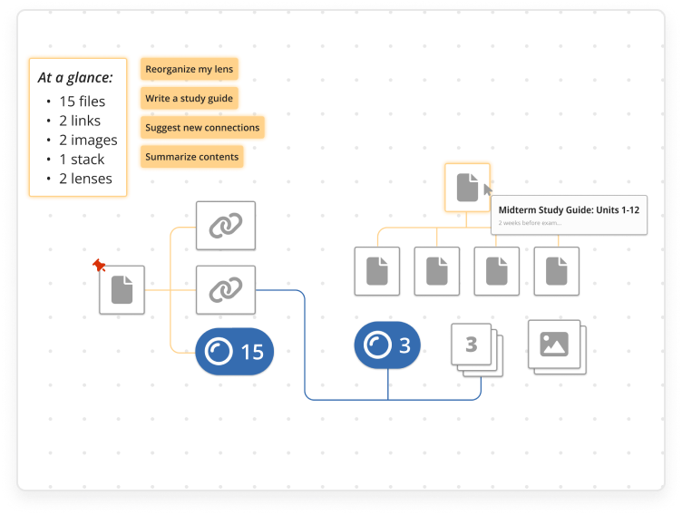
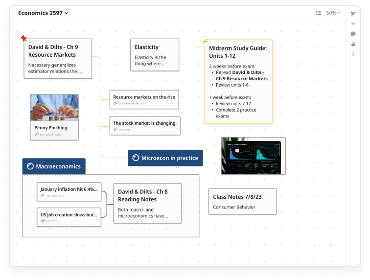
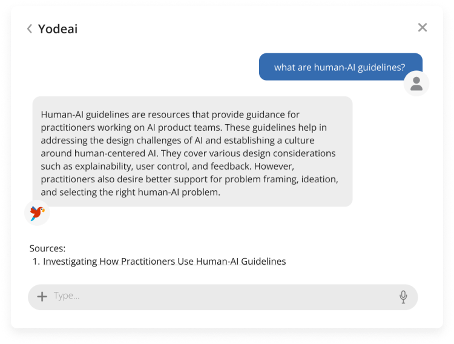

## Introduction

<center>
<i>Transform information overload into knowledge power.</i>

A large amount of essential information gets buried in unstructured data - from extensive PDFs to scattered meeting notes and one-off spreadsheets.

#### Organize: your unstructured data


#### Browse: zoom in and out for a global view


#### Ask: get answers based on your data

</center>

## Demo

[https://yodeai.vercel.app](https://yodeai.vercel.app/)

## Deploy Your Own

You can clone & deploy it to Vercel with one click:

[](https://vercel.com/new/samet-uns-projects/clone?repository-url=https://github.com/yodeai/yodeain)

## Developing Locally

You can clone & create this repo with the following command

```bash
npm run dev
```

## Getting Started

First, install the dependencies:

```bash
pnpm install
```

install pnpm
```bash
pnpm install
```


Then, run the development server:

```bash
pnpm run dev
```

Open [http://localhost:3000](http://localhost:3000) with your browser to see the result.

The FastApi server will be running on [http://127.0.0.1:8000](http://127.0.0.1:8000) – feel free to change the port in `package.json` (you'll also need to update it in `next.config.js`).

## Learn More

To learn more about Next.js, take a look at the following resources:

- [Next.js Documentation](https://nextjs.org/docs) - learn about Next.js features and API.
- [Learn Next.js](https://nextjs.org/learn) - an interactive Next.js tutorial.

You can check out [the Next.js GitHub repository](https://github.com/vercel/next.js/) - your feedback and contributions are welcome!

## Feedback and issues

Please report any feedback or issue reports on [here](https://github.com/yodeai/yodeai/issues).